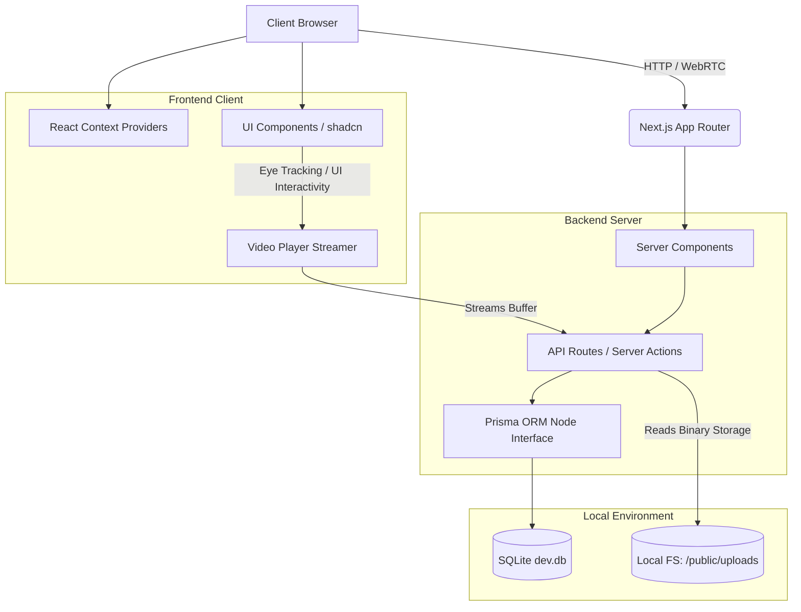
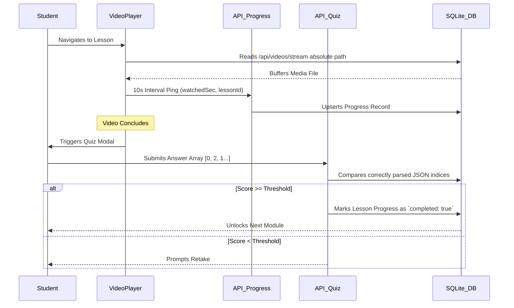
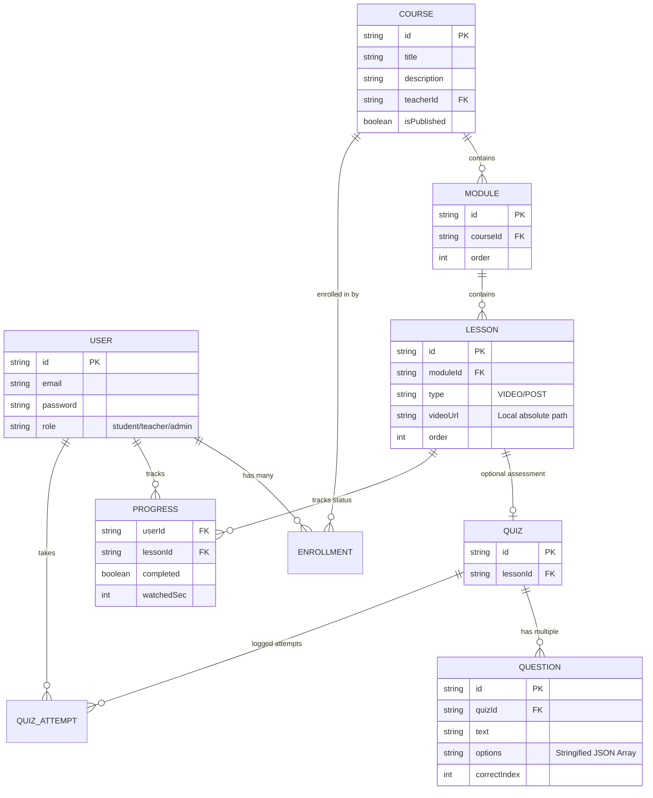

# 🎓 LearnHub - Advanced EdTech Platform


A state-of-the-art, full-stack e-learning platform built to provide an interactive, immersive, and highly performant educational experience. LearnHub empowers educators with robust content-creation tools, while ensuring students remain engaged through AI-assisted learning, eye-tracking focus mode, mandatory quizzes, and seamless course progression.

---

## 🎯 Core Features

- **Dynamic Course Builder:** Instructors can assemble elaborate courses structuring content across **Modules**, **Video Lessons**, and interactive **Markdown Articles**.
- **Assessment Gateways (Quizzes):** Lessons feature integrated quizzes parsing multiple-choice logic. Students are required to pass with customizable thresholds to unlock subsequent materials.
- **Offline-First Storage:** Complete elimination of aggressive third-party cloud billing by storing and streaming compiled video binaries (`.mp4`, `.webm`) directly from the localized server environment.
- **AI Tutor (`app/api/chat`):** A persistent, intelligent contextual chat panel residing alongside video playback to answer complex student queries instantly.
- **Focus Guard (Eye-Tracker):** Optional front-facing camera heuristics validating student attention metrics during video consumption to ensure authentic course completion.
- **Real-Time Live Classes:** Leverages `LiveKit` to host zero-latency broadcasting and multi-participant WebRTC classrooms directly within the dashboard.
- **Custom Access Roles:** Completely sandboxed UI scopes for `admin`, `teacher`, and `student` roles.
- **Progress Tracking Analytics:** Automatic client-to-server pings capturing exact video timestamps to log `watchedSec` and determine percentage-based course progression.

---

## 🧬 System Architecture

The architecture relies heavily on raw React Server Components in Next.js 14/15, utilizing Server Actions for mutating database state, pushing the heavy lifting completely to the backend execution context.



---

## 🔄 Data Flow Architecture (DFA)

The operational pipeline for core user activities is completely isolated. Below represents the Flow Architecture from Video Consumption to Quiz Evaluation:



---

## 🗄️ Database Schema Design (ERD)

LearnHub abstracts away aggressive PostgreSQL models to utilize a blazing-fast localized SQLite environment mapped via Prisma.



---

## 💻 Tech Stack Summary

- **Core Engine:** Next.js (App Router), React 18+
- **Styling:** Tailwind CSS, `shadcn/ui` components
- **Database:** Prisma ORM, SQLite (`dev.db`)
- **Crypto & Security:** `bcryptjs` (Password Hashing), Secure HTTP-Only OTP Cookies
- **Communication:** LiveKit WebRTC (Live classes)

---

## 🛠️ Local Setup Guide

Follow these steps to duplicate the production environment securely on your local machine:

### 1. Clone & Install
```bash
git clone <repository_url>
cd LearnHub
npm install
```

### 2. Environment Configuration
Create an `.env` file at the root of the project to initialize the database and LiveKit bindings.
```env
# Local SQLite Connector
DATABASE_URL="file:./dev.db"

# (Optional) LiveKit Credentials for Live Class Capabilities
LIVEKIT_API_KEY="your_api_key"
LIVEKIT_API_SECRET="your_secret"
NEXT_PUBLIC_LIVEKIT_URL="wss://your-livekit-url.cloud"
```

### 3. Initialize Database Ecosystem
This will parse the `schema.prisma` architecture and spin up a freshly mounted `.db` cache.
```bash
npx prisma generate
npx prisma db push
```

*(Optional) To rapidly test course functionalities, execute a localized node seed file if you have created one to attach mock users.*

### 4. Ignite Development Server
```bash
npm run dev
```

Browse to `http://localhost:3000` to log in and observe the live, compiled EdTech dashboard.
